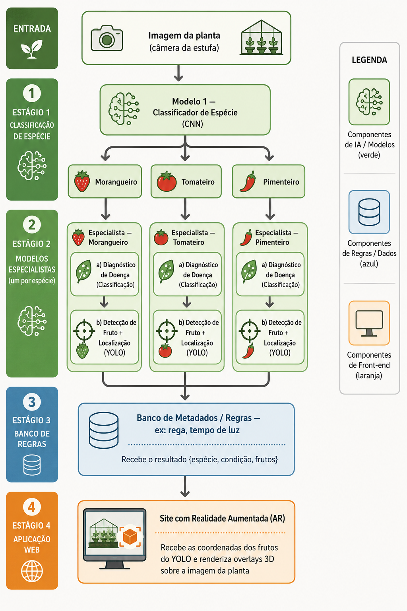

# Stove — Estufa Inteligente com IoT e Visão Computacional

Sistema completo de monitoramento de estufa com sensores IoT, dashboard em tempo real,
autenticação JWT com controle de acesso por perfil, detecção de doenças em plantas por
visão computacional e exibição dos resultados em realidade aumentada.

As plantas-alvo nesta fase são: **morangueiro**, **tomateiro** e **pimenteiro** (pimenta malagueta).

---

## Módulos

| Módulo | Descrição | Stack |
|--------|-----------|-------|
| [`frontend/`](frontend/) | Dashboard React com dados em tempo real via MQTT/SSE | React 19, TypeScript, Tailwind, Three.js, Express |
| [`backend/`](backend/) | API REST com autenticação JWT + integração MQTT | FastAPI, PostgreSQL, paho-mqtt, python-jose |
| [`ml/`](ml/) | Pipeline de visão computacional para classificação e detecção | TensorFlow, OpenCV, MobileNetV2, YOLO, TFLite |

---

## Início Rápido

### 1. Configurar variáveis de ambiente

```bash
cp .env.example .env
```

Edite `.env` com suas credenciais. Os campos obrigatórios são:

| Variável | Descrição |
|----------|-----------|
| `MQTT_HOST` | Host do broker HiveMQ Cloud |
| `MQTT_USER` / `MQTT_PASSWORD` | Credenciais MQTT |
| `SECRET_KEY` | Chave JWT (gere com `openssl rand -hex 32`) |
| `ADMIN_USERNAME` / `ADMIN_PASSWORD` | Usuário superadmin inicial |
| `GEMINI_API_KEY` | Chave da API Gemini (opcional) |

Os valores de PostgreSQL já têm defaults para o container Docker local.

### 2. Subir localmente

```bash
# Desenvolvimento (hot-reload + portas expostas no host)
docker compose -f docker-compose.yml -f docker-compose.dev.yml up -d

# Apenas produção local (sem portas expostas)
docker compose up -d
```

| Serviço | URL (dev) |
|---------|-----------|
| Dashboard | http://localhost:3000 |
| API / Swagger | http://localhost:8000 / http://localhost:8000/docs |

### 3. Deploy em produção (Coolify)

Use o arquivo `docker-compose.prod.yml` no painel do Coolify e configure as variáveis
de ambiente listadas acima. O Traefik do Coolify cuida do roteamento — nenhuma porta é
exposta diretamente.

```bash
docker compose -f docker-compose.prod.yml up -d
```

---

## IoT

Os dispositivos IoT capturam dados ambientais da estufa e imagens das plantas, enviando
tudo via MQTT para o backend.

### Dispositivos

| Dispositivo | Função |
|-------------|--------|
| Raspberry Pi | Câmera de imagem das plantas + execução de inferência local (TFLite) |
| Sensores ambientais | Leituras periódicas das condições da estufa |

### Fluxo de dados

```
Sensor / Câmera (Raspberry Pi)
        │
        │  MQTT over TLS (porta 8883)
        ▼
  HiveMQ Cloud (broker)
        │
        │  Subscribe (paho-mqtt)
        ▼
    Backend (FastAPI)
        │
  ┌─────┴─────┐
  ▼           ▼
PostgreSQL  SSE → Frontend
```

### Inferência embarcada

O modelo de ML é exportado em **TFLite quantizado (int8)**, permitindo que a inferência
ocorra diretamente no Raspberry Pi sem depender de servidores externos. As coordenadas
dos frutos detectados pelo YOLO são enviadas ao backend via MQTT e usadas para gerar os
overlays 3D no frontend.

---

## Conexões — MQTT

O protocolo MQTT (Message Queuing Telemetry Transport) é o canal principal de
comunicação entre os dispositivos IoT e o backend.

### Broker

| Atributo | Valor |
|----------|-------|
| Provedor | HiveMQ Cloud |
| Porta | 8883 (TLS/SSL obrigatório) |
| Autenticação | Usuário + senha (`MQTT_USER` / `MQTT_PASSWORD`) |
| Client ID do backend | `gaia-backend` |
| Prefixo de tópicos | `gaia` (configurável via `MQTT_TOPIC_PREFIX`) |

### Estrutura de tópicos (exemplo)

```
gaia/<device_id>/sensors     ← leituras ambientais periódicas
gaia/<device_id>/camera      ← metadados e resultado de imagem capturada
gaia/<device_id>/inference   ← resultado do pipeline ML {espécie, condição, frutos}
gaia/<device_id>/alerts      ← alertas gerados pelas regras de cultivo
```

### Integração no backend

O backend inicializa um cliente `paho-mqtt` em background na inicialização do FastAPI.
As mensagens recebidas são processadas por handlers específicos por tópico, persistidas
no PostgreSQL e despachadas ao frontend via SSE.

---

## Banco de Dados

Armazena todos os dados persistentes do sistema: usuários, plantas, dispositivos,
leituras de sensores, resultados de inferência e alertas.

### Stack

- **PostgreSQL** em container Docker
- Schema definido em [`backend/SQL/schema.sql`](backend/SQL/schema.sql)
- Acesso via pool de conexões assíncrono

### Entidades principais

| Tabela | Descrição |
|--------|-----------|
| `users` | Usuários com perfil (`superadmin`, `user`) e hash de senha |
| `plants` | Plantas cadastradas, vinculadas a um usuário |
| `devices` | Dispositivos IoT registrados, vinculados a um usuário |
| `sensor_readings` | Série temporal de leituras ambientais |
| `inference_results` | Resultados do pipeline ML (espécie, condição, bounding boxes) |
| `alerts` | Alertas de cultivo com status de leitura |

### Isolamento de dados

Cada usuário acessa apenas os dados vinculados a si próprio (plantas, dispositivos,
leituras, alertas). O superadmin tem acesso irrestrito. O isolamento é garantido a
nível de query — todas as consultas de usuários comuns filtram por `user_id`.

---

## Backend

API REST construída com **FastAPI**, responsável pelo gerenciamento de plantas,
dispositivos, leituras e alertas, além de toda a integração com MQTT.

### Stack

| Componente | Tecnologia |
|------------|------------|
| Framework | FastAPI (Python 3.11+) |
| Banco de dados | PostgreSQL (asyncpg) |
| Autenticação | JWT (python-jose) + bcrypt |
| MQTT | paho-mqtt |
| Documentação | OpenAPI / Swagger (automático em `/docs`) |
| Containerização | Docker + Docker Compose |

### Estrutura do código

```
backend/
└── app/
    ├── auth.py          # JWT, bcrypt, dependências de acesso por perfil
    ├── routers/         # Endpoints REST (auth, users, plants, devices, readings, alerts)
    ├── services/        # Regras de negócio e integração MQTT
    ├── schemas/         # Modelos Pydantic (validação de entrada e saída)
    └── db/              # Pool de conexões, repositório genérico, bootstrap do schema
```

### Principais endpoints

| Método | Rota | Descrição |
|--------|------|-----------|
| `POST` | `/api/v1/auth/login` | Autenticação — retorna JWT |
| `GET` | `/api/v1/plants` | Lista plantas do usuário autenticado |
| `POST` | `/api/v1/plants` | Cadastra nova planta |
| `GET` | `/api/v1/devices` | Lista dispositivos do usuário |
| `GET` | `/api/v1/readings` | Leituras de sensores (com filtros de período) |
| `GET` | `/api/v1/alerts` | Alertas ativos ou histórico |
| `POST` | `/api/v1/users` | Cria usuário (somente superadmin) |

A especificação completa está em [`openapi.json`](openapi.json) ou no Swagger em `/docs`.

### Autenticação

A API utiliza **JWT stateless**. O token é obtido via login e deve ser enviado em todas
as requisições protegidas.

```bash
# Obter token
curl -X POST http://localhost:8000/api/v1/auth/login \
  -H "Content-Type: application/x-www-form-urlencoded" \
  -d "username=admin&password=<senha>"

# Usar token
curl http://localhost:8000/api/v1/plants \
  -H "Authorization: Bearer <token>"
```

#### Perfis de acesso

| Perfil | Acesso |
|--------|--------|
| `superadmin` | Acesso total a todos os recursos e usuários |
| `user` | Acesso apenas aos próprios recursos (plantas, devices, leituras, alertas) |

Usuários são criados exclusivamente por superadmin via `POST /api/v1/users`.

---

## Frontend

Dashboard web que exibe em tempo real os dados da estufa e integra a camada de
realidade aumentada para visualização dos frutos detectados.

### Stack

| Componente | Tecnologia |
|------------|------------|
| Framework | React 19 + TypeScript |
| Estilização | Tailwind CSS |
| Realidade aumentada | Three.js |
| Servidor SSR/proxy | Express (Node.js) |
| Build | Vite |
| Dados em tempo real | SSE (Server-Sent Events) |

### Funcionalidades

- **Dashboard de sensores** — exibe dados ambientais em tempo real com histórico em gráficos.
- **Gestão de plantas e dispositivos** — CRUD completo vinculado ao usuário autenticado.
- **Alertas** — notificações de condições fora do intervalo recomendado pelas regras de cultivo.
- **Realidade aumentada** — usa as coordenadas dos frutos (bounding boxes do YOLO) para
  renderizar overlays 3D sobre a imagem da planta com Three.js.
- **Autenticação** — fluxo completo de login/logout com JWT.

### Dados em tempo real

O frontend conecta ao backend via **SSE (Server-Sent Events)**. O Express atua como
proxy, mantendo a conexão SSE aberta e encaminhando eventos originados por mensagens
MQTT recebidas dos dispositivos.

```
Dispositivo IoT → MQTT → FastAPI → SSE → Express → React
```

---

## Machine Learning

Módulo de visão computacional responsável por identificar a espécie da planta,
diagnosticar doenças e localizar frutos com coordenadas precisas para a camada de AR.

### Arquitetura — dois estágios de modelos

A estratégia central é uma **arquitetura em dois estágios** de modelos de IA, seguida
por uma camada de regras (não-IA) e pela aplicação web.

#### Diagrama do fluxo



> Versão vetorial editável: [`docs/fluxo_sistema_visao_estufa.svg`](docs/fluxo_sistema_visao_estufa.svg)

#### Descrição do fluxo

**Entrada.** Uma imagem da planta é capturada pela câmera da estufa e enviada ao pipeline.

**Estágio 1 — Classificação de espécie (IA).** Um classificador CNN com transfer
learning (MobileNetV2) responde a uma única pergunta: *qual das três plantas é esta?*
A saída é uma entre `morangueiro`, `tomateiro` ou `pimenteiro`. Como as três espécies
são visualmente distintas, este modelo tende a ter alta acurácia mesmo com um conjunto
de dados modesto.

**Estágio 2 — Modelos especialistas (IA).** A espécie identificada no Estágio 1
direciona a imagem para o modelo especialista correspondente. Cada especialista executa
duas sub-tarefas:

- **Diagnóstico de doença** — tarefa de *classificação* (a planta está saudável? qual
  doença?). As doenças são específicas de cada espécie, por isso os especialistas são
  separados.
- **Detecção e localização de fruto** — tarefa de *detecção de objeto* (YOLO), que
  além de indicar a presença do fruto fornece suas **coordenadas** (bounding boxes).
  Essas coordenadas são necessárias para a camada de realidade aumentada.

**Estágio 3 — Banco de metadados / regras (não-IA).** Recebe o resultado consolidado
dos modelos — `{espécie, condição, frutos}` — e aplica regras de cultivo. Exemplo: se
for morangueiro, recomenda determinado volume de rega e tempo de iluminação (a estufa
usa lâmpada própria). Essa camada **não é um modelo de IA**: é uma tabela de regras /
banco de dados, o que permite ajustar recomendações sem retreinar nenhum modelo.

**Estágio 4 — Aplicação web com realidade aumentada.** Usa as coordenadas dos frutos
fornecidas pelo YOLO para ancorar overlays 3D sobre a imagem/vídeo, mostrando o estado
da planta e a presença de frutos.

### Por que dois estágios?

| Vantagem | Explicação |
|----------|------------|
| Resolve o desbalanceamento | A espécie vira uma decisão isolada; cada especialista treina só com os dados da sua planta, eliminando o viés entre classes (ex.: muito mais tomate que morango). |
| Modelos mais simples e precisos | Cada modelo aprende um problema menor e mais focado. |
| Manutenção independente | Adicionar uma planta ou doença nova afeta apenas um módulo. |
| Tipo de modelo adequado por tarefa | Classificação onde cabe classificação; detecção (YOLO) só onde se precisa localizar. |

**Trade-offs assumidos:** erro de espécie no Estágio 1 se propaga para o especialista
errado (mitigado por limiar de confiança); e há mais artefatos para manter e servir do
que num modelo único.

### Pipeline de treino

O [`pipeline.py`](ml/training/pipeline.py) é um pipeline de classificação reutilizável
que pode ser apontado para diferentes árvores de dados (espécie, ou doença de cada
planta). Etapas:

1. Carregamento e exploração dos dados
2. Pré-processamento com OpenCV
3. Separação treino / validação / teste
4. Criação do modelo (CNN + transfer learning — MobileNetV2)
5. Treinamento com callbacks e visualização
6. Avaliação (matriz de confusão + métricas)
7. Exportação do modelo (SavedModel + TFLite)
8. Inferência em produção

### Stack de ML

**Stack:** Python · OpenCV · TensorFlow / Keras · scikit-learn · Ultralytics YOLO

**Características técnicas:**

- Transfer learning com MobileNetV2 (leve, adequado a hardware embarcado)
- Imagens redimensionadas para 128×128 (otimizado para Raspberry Pi)
- `class_weight` balanceado e data augmentation para mitigar desbalanceamento
- Exportação para **TFLite quantizado (int8)** para rodar em dispositivos embarcados

**Estrutura de dados esperada** (classificação — uma pasta por classe):

```
dataset/
  NomeClasse1/
    imagem1.jpg
    imagem2.jpg
  NomeClasse2/
    ...
```

### Datasets

Os dados são coletados de múltiplas fontes pelo
[`download_dataset.py`](ml/training/download_dataset.py). Todos os datasets utilizados
estão sob licença **CC BY 4.0** (uso permitido com atribuição).

| Dataset | Cultura | Tipo | Fonte |
|---------|---------|------|-------|
| PlantVillage | múltiplas | classificação | Kaggle |
| Strawberry Disease | morango | detecção | Kaggle / Roboflow |
| Chili Plant Disease | pimenta | classificação | Kaggle |
| PlantDoc | múltiplas (campo real) | detecção | GitHub |

> **Nota sobre robustez:** o PlantVillage contém imagens de laboratório (fundo limpo).
> Para o sistema funcionar em fotos reais de estufa, os datasets de campo (PlantDoc)
> são importantes para reduzir o viés de fundo controlado.

Os créditos das fontes de cada dataset devem ser preservados conforme exigido pela
licença CC BY 4.0. Ver o arquivo `ATTRIBUTIONS.md`.

### Estrutura do módulo ML

```
ml/
├── training/
│   ├── pipeline.py            # pipeline de treino (classificação)
│   ├── download_dataset.py    # coleta e organização dos datasets
│   ├── docs/                  # imagens da arquitetura (diagramas)
│   ├── datasets_raw/          # datasets brutos baixados
│   └── outputs/               # modelos, logs, gráficos, métricas
├── inference/                 # módulo de inferência (produção)
├── datasets/                  # gitignored
└── models/                    # gitignored
```

### Como executar o pipeline

```bash
# 1. Instalar dependências
pip install kagglehub tensorflow opencv-python scikit-learn matplotlib seaborn

# 2. Configurar credenciais do Kaggle (kaggle.json em ~/.kaggle/)

# 3. Baixar e organizar os datasets
python ml/training/download_dataset.py

# 4. Treinar um modelo (ajuste Config.DATASET_ROOT no pipeline.py)
python ml/training/pipeline.py
```

---

## Variáveis de Ambiente

```env
# PostgreSQL (container Docker local)
PGHOST=postgres
PGDATABASE=stovedb
PGUSER=stove
PGPASSWORD=<senha>
PGSSLMODE=disable
PGCHANNELBINDING=disable

# MQTT (HiveMQ Cloud)
MQTT_HOST=<cluster>.s1.eu.hivemq.cloud
MQTT_PORT=8883
MQTT_USER=<usuario>
MQTT_PASSWORD=<senha>
MQTT_USE_TLS=true
MQTT_CLIENT_ID=gaia-backend
MQTT_TOPIC_PREFIX=gaia

# JWT / Autenticação
SECRET_KEY=<chave-aleatoria-min-32-chars>
ACCESS_TOKEN_EXPIRE_MINUTES=60
ADMIN_USERNAME=admin
ADMIN_PASSWORD=<senha-forte>

# Frontend
GEMINI_API_KEY=<chave-gemini>
APP_URL=https://<seu-dominio>
```

---

## Estrutura

```
project_stove/
├── frontend/              # React + Express + Vite
├── backend/               # FastAPI + PostgreSQL + MQTT
│   ├── app/
│   │   ├── auth.py        # JWT, bcrypt, dependências de acesso
│   │   ├── routers/       # Endpoints REST (auth, users, plants, ...)
│   │   ├── services/      # Regras de negócio
│   │   ├── schemas/       # Modelos Pydantic
│   │   └── db/            # Pool, repositório genérico, bootstrap
│   └── SQL/
│       └── schema.sql     # Schema PostgreSQL completo
├── ml/                    # Pipeline de visão computacional
│   ├── training/
│   ├── inference/
│   ├── datasets/          # gitignored
│   └── models/            # gitignored
├── openapi.json           # Spec OpenAPI gerada do backend
├── docker-compose.yml     # Base
├── docker-compose.dev.yml # Override de desenvolvimento (portas expostas, hot-reload)
├── docker-compose.prod.yml# Configuração para Coolify (sem port bindings)
└── .env.example
```

---

## OpenAPI

O arquivo [`openapi.json`](openapi.json) contém a especificação completa da API.
Use-o para:
- Gerar um client TypeScript com `openapi-typescript`
- Importar no Postman/Insomnia para testes
- Visualizar no [Swagger Editor](https://editor.swagger.io)

---

## Roadmap

- [ ] Estágio 1 — classificador de espécie (3 classes)
- [ ] Estágio 2 — especialista de doença por planta
- [ ] Estágio 2 — detector de fruto (YOLO) por planta
- [ ] Banco de regras de cultivo (rega / iluminação)
- [ ] Aplicação web com realidade aumentada
- [ ] Dataset proprietário (para uso comercial do produto)

---

## Observações

- Esta é a fase de pesquisa, com publicação de um *paper* como objetivo inicial.
- Para a versão de **produto comercial**, está previsto um **dataset proprietário**,
  evitando dependência de imagens de fontes com licença ambígua para uso comercial.

---

## Segurança

- **Nunca commite o arquivo `.env`.** Ele está no `.gitignore`.
- Regenere a `SECRET_KEY` em produção com `openssl rand -hex 32`.
- Se credenciais foram expostas no histórico Git, revogue-as imediatamente.

---

## Licença

A definir. Os datasets de terceiros mantêm suas respectivas licenças (CC BY 4.0).
